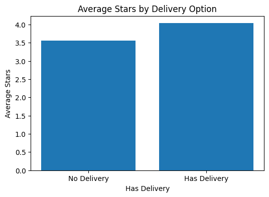
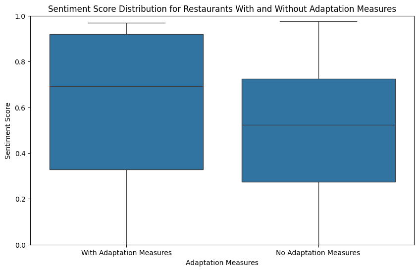

# AI-Powered Sentiment and Customer Insight Analysis for California Bars During COVID-19

This project applies NLP techniques (VADER and BERT) on over 119,000 Yelp reviews to uncover how bars in California adapted to the COVID-19 pandemic and how customers responded:
The COVID-19 pandemic caused unprecedented disruptions to California's bar industry, forcing widespread closures and operational shifts such as delivery and outdoor seating. Understanding how customers responded to these adaptations—and which strategies improved satisfaction—remained unclear. This project aims to uncover customer sentiment trends, loyalty behaviors, and the effectiveness of adaptation strategies by analyzing 119K+ Yelp reviews using Natural Language Processing techniques. The goal is to support data-driven recovery planning for bar owners, policymakers, and consumers.

## Project Highlights
- **Sentiment Analysis**: Detected customer satisfaction trends using VADER.
- **Topic Modeling**: Extracted themes using BERT for customer concerns and preferences.
- **Impact Analysis**: Delivery services were significantly correlated with higher star ratings and sentiment (p < 0.05).
- **Customer Segmentation**: Identified loyal customers and their preferred services.

## Key Visualizations
### Average Rating by Delivery Service
Bars that offered delivery during the COVID-19 pandemic received significantly higher average ratings compared to those that did not (4.0 vs. 3.5, *p* = 0.010). This suggests that customers appreciated the added convenience and safety of delivery options.

### Sentiment Score by Adaptation Measures
Bars that implemented adaptation measures (e.g., delivery, contactless service, outdoor seating) had significantly higher sentiment scores compared to those that did not (*p* < 0.001). Among all measures, **contactless and touchless services** had the strongest positive impact on customer sentiment.

## Files
- `FinalProject_Team010.ipynb`: Full code and analysis
- `slides (Google Slide)/`: Final presentation

## Presentation Slides
[Google Slides (View Only)](https://docs.google.com/presentation/d/1ecz8wR_qxiFOYmy9qpOxCKBWDeFurytP/edit?usp=sharing&ouid=104301292306575929503&rtpof=true&sd=true)

## Tools
Python · Pandas · NLP · VADER · BERT · Matplotlib · Hypothesis Testing

## Conclusion
Bars that implemented adaptation strategies—particularly delivery and takeout—achieved higher customer satisfaction and engagement during the COVID-19 pandemic. Our analysis of 119,000+ Yelp reviews shows that:
- Bars offering delivery had significantly higher average ratings (4.0 vs. 3.5, p = 0.010)
- These businesses also received more reviews (381 vs. 55, p = 0.038), indicating stronger customer engagement
- Sentiment scores were significantly higher among adapted businesses (p < 0.001), especially those implementing contactless services

These findings demonstrate that customer-centric adaptations—especially those prioritizing safety and convenience—played a key role in mitigating pandemic-related business losses.
